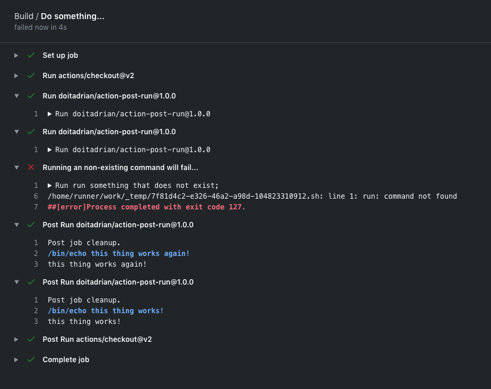

# Hello world javascript action

A simple GitHub action that enables running post-run tasks, once a workflow job has ended.

## Inputs

### `command`

**Required** The name of the person to greet. Default `"World"`.

## Example usage

```yaml
name: Build

on:
  push:
    branches: [ master ]

env:
  GH_TOKEN: ${{ secrets.GH_TOKEN }}

jobs:
  build-test-release:
    name: Conventional Commits
    runs-on: ubuntu-latest
    steps:
      - uses: actions/checkout@v2
    
      - uses: doitadrian/action-post@master
        id: post-run-command
        with:
          command: echo "this thing works!"

      - uses: doitadrian/action-post@master
        id: another-post-run-command
        with:
          command: echo "this thing works again!"

      - name: 'Running a unexisting command will fail...'
        run: run something that does not exist;
```

This above configuration will produce the following:


